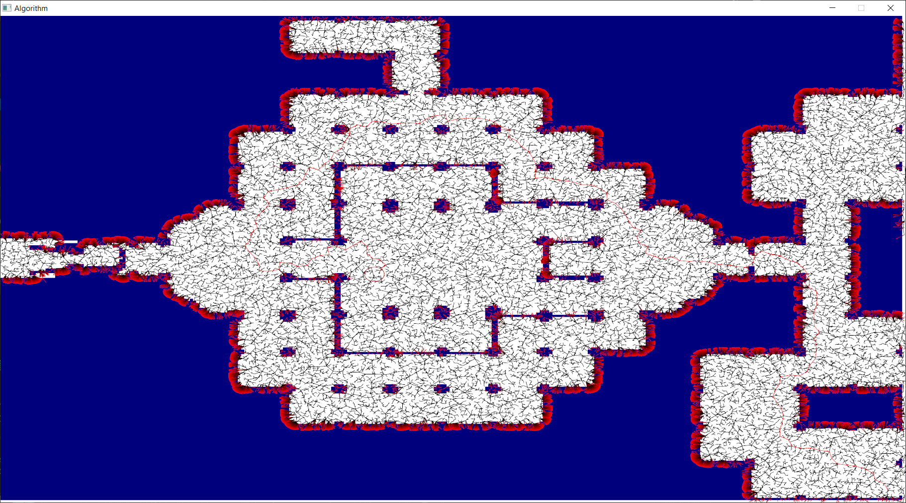
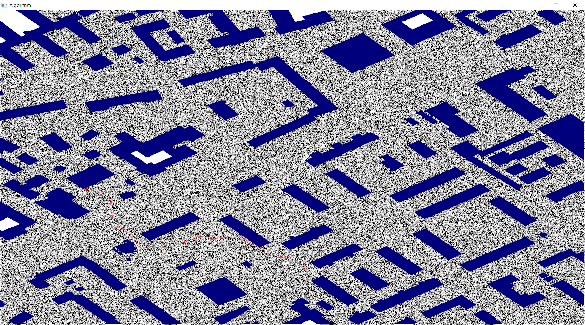
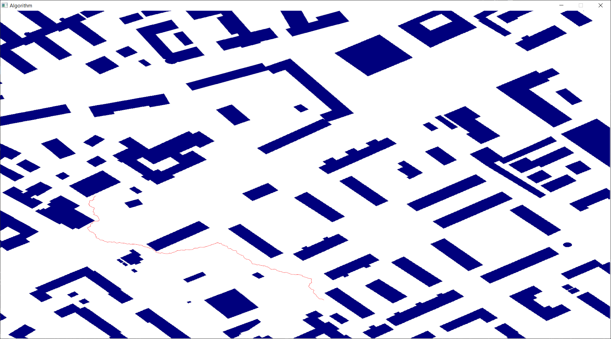

# PathPlanningAlgorithms(RRT, RRT*)


## Getting started
### Linux and Mac
Release building
```bash
cd PathPlanningAlgorithms-RRT-RRTstar-
cmake . -DCMAKE_BUILD_TYPE="Release" -Bbuild
cd build
make install
```

Debug building
```bash
cd PathPlanningAlgorithms-RRT-RRTstar-
cmake . -DCMAKE_BUILD_TYPE="Debug" -Bbuild
cd build
make install
```

### Windows
Release building
```cmd
cd PathPlanningAlgorithms-RRT-RRTstar-
cmake . -DCMAKE_BUILD_TYPE="Release" -Bbuild -G"MinGW Makefiles"
cd build
mingw32-make install
```

Debug building
```cmd
cd PathPlanningAlgorithms-RRT-RRTstar-
cmake . -DCMAKE_BUILD_TYPE="Debug" -Bbuild -G"MinGW Makefiles"
cd build
mingw32-make install
```
## Visualizer
# RRTAlgorithm::launchWithVirt


# RRTAlgorithm::launchWithVirtAfter

# RRTAlgorithm::launchWithVirtAfterWithoutTree
