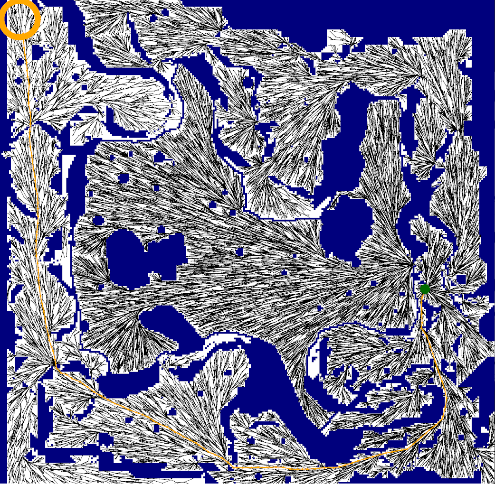
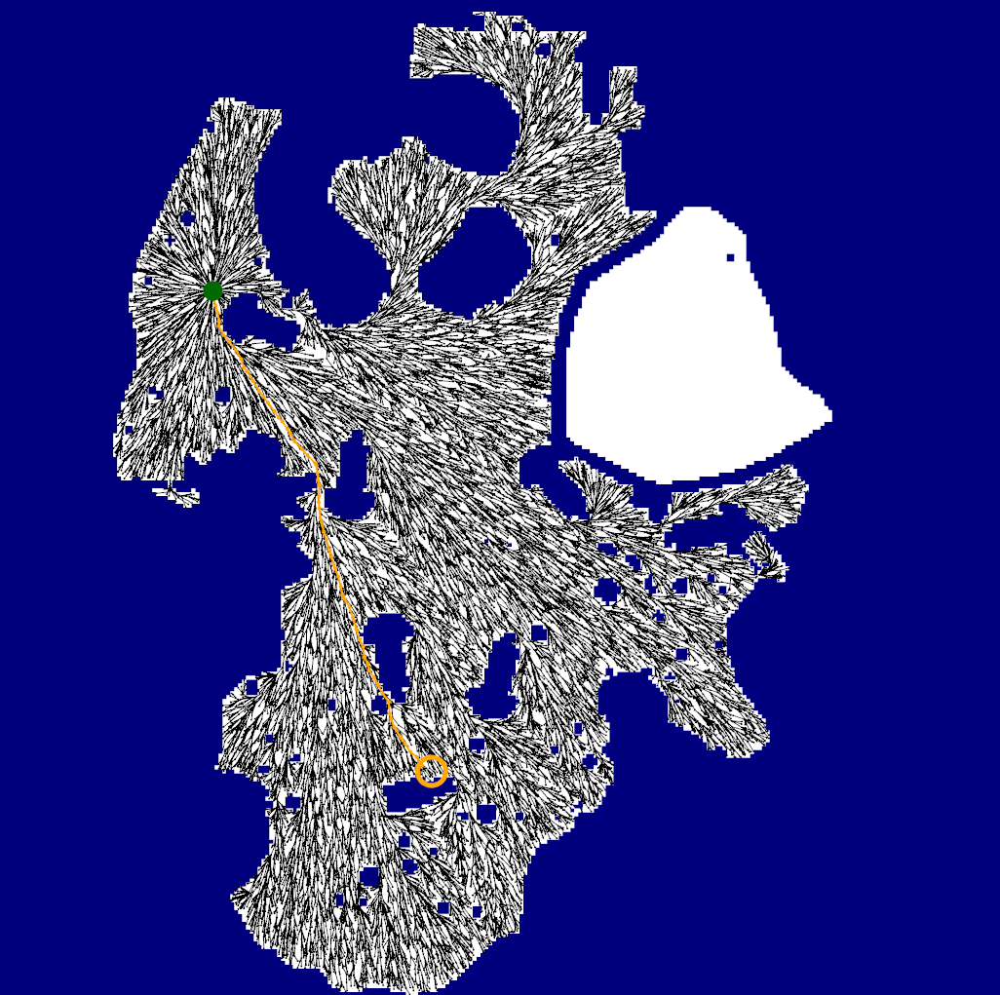
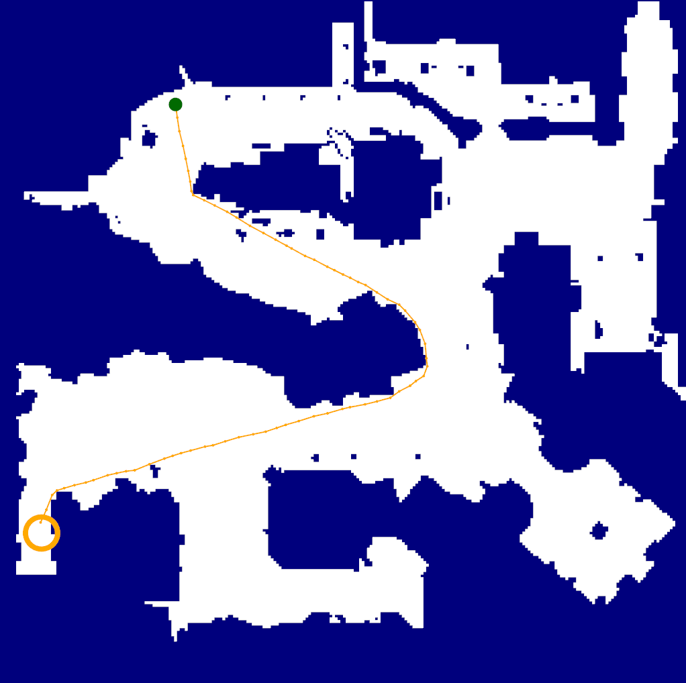
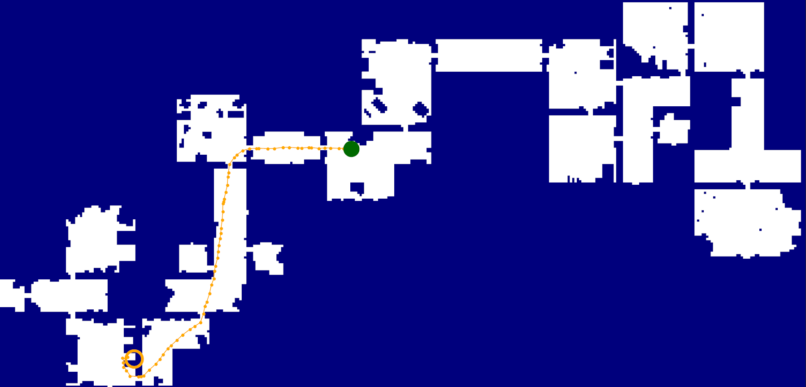

# PathPlanningAlgorithms (RRT, RRT*)

## Description

A software project at the Higher School of Economics.
Pathfinding algorithms.

This project uses

- [pugixml](https://github.com/zeux/pugixml) - for parsing XML
- [nanoflann](https://github.com/jlblancoc/nanoflann) - kd tree, is used to find the n nearest neighbors and find the nearest neighbors in the radius
- [SFML](https://github.com/SFML/SFML) - to create a visualizer

## Installing

Download current repository to your local machine. Use

```bash
git clone https://github.com/Ch0p1k3/path-planning-algorithms-rrt-rrtstar
```

The project requires submodules, to install them use

```bash
cd path-planning-algorithms-rrt-rrtstar
git submodule init
git submodule update
```

## Input and output

### Input file

- Mandatory tag `root`. It describes the parameters.
  - Tag `map`. It describes the map.
    - `height` - the height of the field. A positive number.
    - `width` - the width of the field. A positive number.
    - `startx` - the start coordinate x. A number from `0` to `width - 1`.
    - `starty` - the start coordinate y. A number from `0` to `height - 1`.
    - `finishx` - the finish coordinate x. A number from `0` to `width - 1`.
    - `finishy` - the finish coordinate y. A number from `0` to `height - 1`.
    - Tag `grid` describes your map, where each line is separated by a `line` tag. `0` is free cell, `1` is obstruction.
  - Tag `algorithm` describes the algrithm options.
    - `searchtype` - the type of the search. Arguments are `rrt` or `rrtstar`. RRT and RRT* algorithm, respectively.
    - `numberofiterations` - number of iterations of the algorithm. In the case of RRT, if a path is found, the construction of the tree stops. In the case of RRT* algorithm will be improve path length. If you do not specify this tag, the default is set to 100000.
    - `stepsize` - maximum edge size in a tree. If you do not specify this tag, the default is set to 3. The value must be greater or equal than 1.
    - `eps` - error area the finish point. If you do not specify this tag, the default is set to 3. The value must be greater or equal than 1.
    - `gamma` - constant for RRT*, see RRT* description for details.
  - Tag `log` - specified output options. This is optional. If there are not the tag, the output file will be create in the same name and directory with suffix _log.
    - `path` - path to output file(with the name of file).

You can see an example of input data in the folder `tests`. [Sample](https://github.com/Ch0p1k3/path-planning-algorithms-rrt-rrtstar/blob/main/tests/sample/example.xml). In case of incorrect data, there may be undefined behavior.

### Output file

- Tag `root`. It describes the parameters.
  - `time` - algorithm running time.
  - `countofedges` - number of edges created.
  - `pathfound` - the tag that describes whether a path is found.
  - `distance` - length of the path found.
  - `path` - describes points of the path.
  - `timefirst` - it is only for RRT*, algorithm running time, time spent finding the first path.
  - `countofedgesfirst` - it is only for RRT*, count of edges spent finding the first path.
  - `distancefirst` - it is only for RRT*, distance finding the first path.
  - `pathfirst` - it is only for RRT*, describes points of the first path.

[Example of output data](https://github.com/Ch0p1k3/path-planning-algorithms-rrt-rrtstar/blob/main/tests/sample/example_log.xml).

## Getting started

To build and run the project you should have compiler on C++17 standart.

The project should be built with CMake.

Building and launching can be done both from the command line and using various IDEs. Below are the build and run scripts using the command line.

In order to build SFML on Linux, several libraries and their development headers need to be installed first. [Tutorial: Installing SFML dependencies.](https://github.com/SFML/SFML/wiki/Tutorial%3A-Installing-SFML-dependencies). Or launch `install.sh` from script folder.

#### Windows
```cmd
cd path-planning-algorithms-rrt-rrtstar/src/lib/SFML
cmake . -DCMAKE_BUILD_TYPE="Release" -Bbuild -G"MinGW Makefiles" -DCMAKE_INSTALL_PREFIX="SFML"
```

#### Linux and Mac
```bash
cd path-planning-algorithms-rrt-rrtstar/src/lib/SFML
cmake . -DCMAKE_BUILD_TYPE="Release" -Bbuild -DCMAKE_INSTALL_PREFIX="SFML"
```

After these steps you will have SFML. The next is the build of the project itself.

#### Linux and Mac

**Release building**

```bash
cd path-planning-algorithms-rrt-rrtstar
cmake . -DCMAKE_BUILD_TYPE="Release" -Bbuild --target rrt-rrtstar
```

**Debug building**

```bash
cd path-planning-algorithms-rrt-rrtstar
cmake . -DCMAKE_BUILD_TYPE="Debug" -Bbuild --target rrt-rrtstar
```

#### Windows

**Release building**

```cmd
cd path-planning-algorithms-rrt-rrtstar
cmake . -DCMAKE_BUILD_TYPE="Release" -Bbuild --target rrt-rrtstar -G"MinGW Makefiles"
```

**Debug building**

```cmd
cd path-planning-algorithms-rrt-rrtstar
cmake . -DCMAKE_BUILD_TYPE="Debug" -Bbuild --target rrt-rrtstar -G"MinGW Makefiles"
```

**Launching**

```bash
cd build/bin/rrt-rrtstar <path to XML file> <args>
```

**Arguments**

In addition to the input data, there are arguments

- `-v` - launch with a visualizer that builds a tree online.
- `-va` - launch with a visualizer that will show the worked out algorithm at the end.
- `-vawt` - same as `-va`, but without the tree itself.
- `-secret` - just draws map, start and finish points.

If no arguments are specified, then the launch will be without a visualizer. All other arguments are ignored.

Algorithm time in -v mode NOT EXACT.

Argument priority

- `-secret`
- `-vawt`
- `-va`
- `-v`

That is, if a higher priority argument is specified, the others will be ignored.

## Visualizer

### Launch with visualizer

- `-v`

RRT


RRT*


- `-va` - same as `-v`, but after working out the algorithm

RRT


RRT*



- `-vawt`

RRT


RRT*



## Sources

- LaValle, Steven M., Rapidly-exploring random trees: A new tool for path planning. Technical Report. Computer Science Department, Iowa State University  [**URL**](http://msl.cs.uiuc.edu/~lavalle/papers/Lav98c.pdf)

- LaValle, Steven M.; Kuffner Jr., James J., Randomized Kinodynamic Planning. The International Journal of Robotics Research (IJRR), [**URL**](http://msl.cs.uiuc.edu/~lavalle/papers/LavKuf01b.pdf)

- Karaman Sertac, Frazzoli Emilio, Incremental Sampling-based Algorithms for Optimal Motion Planning, [**URL**](https://arxiv.org/pdf/1005.0416.pdf)

- Karaman Sertac, Frazzoli Emilio, Sampling-based Algorithms for Optimal Motion Planning, [**URL**](https://journals.sagepub.com/doi/pdf/10.1177/0278364911406761?casa_token=ru3w0CN-S1kAAAAA:PZXGaHXATpK2HATSCe6dzIKmdD9Sw5SpMgfY5nvRT3_k2u6LIeMh_keR20m6EYjYQuQoaDzhCteg)

- Iram Noreen, Amna Khan, Zulfiqar Habib, Optimal Path Planning using RRT* based, [**URL**](https://pdfs.semanticscholar.org/9c35/2fec7a86c875eec17fc054106414b6914b7d.pdf)

- Sturtevant, N., Transactions on Computational Intelligence and AI in Games, Benchmarks for Grid-Based Pathfinding, vol. 4, num. 2, pp. 144-148

## Mentors

Yakovlev Konstantin Sergeevich

- kyakovlev@hse.ru
- [HSE website](https://www.hse.ru/staff/yakovlev-ks)
- Telegram: @KonstantinYakovlev

Dergachev Stepan

- sadergachev@edu.hse.ru
- Telegram: @haiot4105


## Me

Luchsh Ivan

- Telegram: @ch0p1k3
